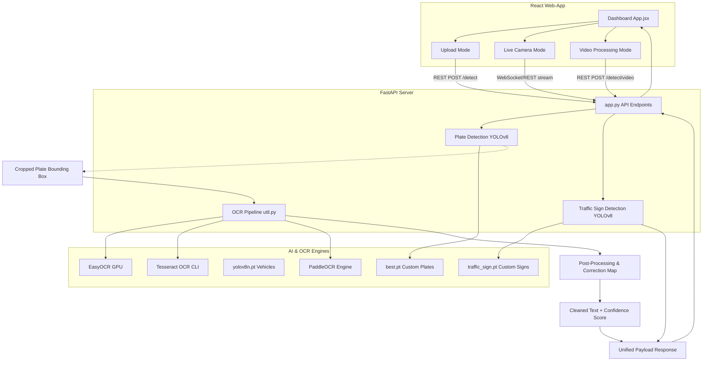

# 🚗 VisionAI Pro: License Plate & Traffic Sign Detection System

[](https://fastapi.tiangolo.com/)
[](https://reactjs.org/)
[](https://vitejs.dev/)
[](https://tailwindcss.com/)
[](https://github.com/ultralytics/ultralytics)
[](https://github.com/JaidedAI/EasyOCR)
[](https://github.com/tesseract-ocr/tesseract)

**VisionAI Pro** is a state-of-the-art, high-performance Computer Vision system designed for automated **License Plate Recognition (LPR/ANPR)** and **Traffic Sign Detection & Classification**. 

Equipped with a sleek, dark-themed React + Tailwind CSS web dashboard and a fast, concurrent FastAPI backend, the application allows users to process **images, offline videos, and live camera streams** in real time. It utilizes optimized YOLOv8 detection models and custom-trained classifiers combined with advanced image preprocessing algorithms for superior OCR accuracy (fully optimized for standard and Sri Lankan license plates).

---

## 🎯 Key Features

- 🚘 **Dual YOLOv8 Model Pipeline**:
  - **License Plate Detection**: Powered by a custom-trained YOLOv8 model (`best.pt`) optimized for locating plate layouts under challenging conditions.
  - **Traffic Sign Classification**: Custom YOLOv8 model (`traffic_sign.pt`) classifying 15 essential signs (Stop, Yield, Speed Limit, Traffic Lights, Warning, One Way, etc.).
- 🔬 **Advanced Multi-Engine OCR**:
  - Out-of-the-box support for **Tesseract OCR**, **EasyOCR** (GPU accelerated), and **PaddleOCR**.
  - Optimized Tesseract setup using **8 different Page Segmentation Modes (PSM)** (Modes: 3, 4, 5, 6, 7, 8, 11, 13) and character whitelisting for high-speed alphanumeric extraction.
- ⚙️ **10-Step Image Preprocessing Pipeline**:
  - Color-space conversion, cubic super-resolution, bilateral and NLMeans noise reduction, multi-scale contrast adjustment (CLAHE, Adaptive histogram, Gamma correction), precision Hough-transform deskewing, Laplacian edge-sharpening, and adaptive thresholding to maximize OCR success on distorted plates.
- 📝 **Sri Lankan Plate Post-Processing Correction**:
  - Dictionary-based mapping of **40+ character confusions** (e.g., `O` ↔ `0`, `I` ↔ `1`, `S` ↔ `5`, `Z` ↔ `2`).
  - Regex validation against standard and Sri Lankan formats and a robust multi-metric confidence-scoring algorithm.
- ⚡ **Interactive Web Dashboard**:
  - **Single Image Upload**: Upload drag-and-drop images to analyze plates and signs side-by-side with cropped visualizers.
  - **Video Processing Mode**: Process videos asynchronously, generate overlaid bounding boxes (Cyan for plates, Orange for traffic signs), see real-time statistics, and download high-resolution outputs.
  - **Live Camera Stream**: Stream video directly from your webcam to classify objects and overlay OCR outputs instantly.
- 🛠️ **CLI Batch Scripts**:
  - Ready-to-use Python scripts (`license_plate_detector.py`, `main.py`) for automated background batch-video processing, vehicle tracking (via ByteTrack/Supervision), and console metrics compilation.

---

## 🏗️ System Architecture



---

## 🛠️ Technology Stack

### Backend & AI Infrastructure
- **FastAPI**: Asynchronous high-performance web API framework.
- **Uvicorn**: Lightning-fast ASGI server implementation.
- **Ultralytics YOLOv8**: Modern real-time object detection models.
- **OpenCV Python**: Comprehensive computer vision libraries for image transformation and frame capture.
- **EasyOCR / PyTesseract / PaddleOCR**: Advanced Optical Character Recognition engines.
- **Supervision & ByteTrack**: Professional vehicle tracking tools.

### Frontend Dashboard
- **React.js (Vite)**: Component-based modern frontend.
- **Tailwind CSS**: Utility-first CSS framework for visual aesthetics.
- **Lucide React**: Clean, modern iconography.
- **HTML5 Canvas**: Frame drawing overlays for real-time cameras.

---

## 📂 Project Structure

```text
├── licsen-number-plate-detection/
│   ├── app.py                     # Core FastAPI backend endpoint definitions
│   ├── license_plate_detector.py  # Standalone CLI EasyOCR batch processing tool
│   ├── main.py                    # Vehicle tracking CLI using ByteTrack + Tesseract
│   ├── util.py                    # Comprehensive OCR Pipeline (10 Preprocess, Validation, Maps)
│   ├── requirements.txt           # Python backend dependencies
│   ├── best.pt                    # Custom trained YOLOv8 model for License Plates
│   ├── traffic_sign.pt            # Custom trained YOLOv8 model for Traffic Signs
│   ├── yolov8n.pt                 # Pre-trained YOLOv8 Nano model (Vehicles/Fallback)
│   ├── sample_video.mp4           # Test video file
│   ├── processed_videos/          # Storage directory for processed video files
│   │
│   └── web-app/                   # React Frontend Project
│       ├── package.json           # Frontend packages and scripts
│       ├── tailwind.config.js     # Tailwind setup
│       ├── index.html             # Entry points
│       ├── src/
│       │   ├── App.jsx            # Core UI component & navigational controller
│       │   ├── main.jsx           # React app mount script
│       │   ├── index.css          # Styling stylesheet
│       │   ├── components/        # Dashboards
│       │   │   ├── UploadMode.jsx # Image Drag-and-Drop and Table list
│       │   │   ├── CameraMode.jsx # Live camera video stream receiver
│       │   │   └── VideoMode.jsx  # Asynchronous video processing and statistics
│       │   └── utils/
│       │       └── detection.js   # Frontend API handler utilities
```

---

## 🚥 Traffic Sign Classes

The `traffic_sign.pt` model detects and classifies the following 15 distinct road sign classes:

| Class ID | Traffic Sign | Class ID | Traffic Sign |
| :---: | :--- | :---: | :--- |
| **0** | Speed Limit | **8** | Straight Only |
| **1** | Stop | **9** | No Parking |
| **2** | Yield | **10** | Warning |
| **3** | No Entry | **11** | School Zone |
| **4** | Pedestrian Crossing | **12** | Hospital |
| **5** | Traffic Light | **13** | Railway Crossing |
| **6** | Turn Right | **14** | One Way |
| **7** | Turn Left | | |

---

## 🚀 Setup & Installation

### Prerequisite Systems
1. **Python 3.8 - 3.10** installed.
2. **Node.js (v16+) & npm** installed.
3. (Optional) **Tesseract OCR Engine** installed locally (Ensure to add `tesseract.exe` path inside your system Environment Variables or update line 20 of `util.py` to point to your `tesseract.exe`).
4. (Optional) **CUDA Toolkit & cuDNN** (for NVIDIA GPU accelerated processing).

### 1. Backend Server Setup
From the root directory:
```bash
# Create a virtual environment
python -m venv .venv

# Activate the virtual environment
# On Windows (PowerShell):
.venv\Scripts\Activate.ps1
# On Linux/macOS:
source .venv/bin/activate

# Install required dependencies
pip install -r requirements.txt
```

### 2. Frontend Project Setup
Go into the `web-app` directory and install NPM packages:
```bash
cd web-app
npm install
```

---

## 🏃 Running the Application

### Start the FastAPI Backend
From the root folder (ensure your virtual environment is active):
```bash
python app.py
```
*The FastAPI backend will spin up locally on **`http://localhost:8000`**.*

### Start the React Frontend
From the `web-app` folder:
```bash
npm run dev
```
*The React dev server will spin up on **`http://localhost:5173`**.*

Open your web browser and navigate to **`http://localhost:5173`** to interact with the **VisionAI Pro** interface!

---

## 💻 CLI Tool & Tracking Operations

For local processing and offline batch operation, two highly efficient CLI scripts are available:

### EasyOCR Bulk Video Processing (`license_plate_detector.py`)
Processes offline video feeds, detects plates, OCRs the characters, and writes annotated videos.
```bash
python license_plate_detector.py --input sample_video.mp4 --output output_detected.mp4 --confidence 0.4 --gpu True --display True
```

### ByteTrack Vehicle Tracking & Tesseract Pipeline (`main.py`)
Monitors vehicles (cars, motorbikes, buses, trucks) along with their license plates, tracks vehicle paths utilizing the advanced ByteTrack algorithm, and runs localized Tesseract OCR.
```bash
python main.py
```

---

## 🧪 Advanced Image Preprocessing Workflow

In `util.py`, the image preprocessing pipeline acts as the system's core differentiator. It transforms highly degraded cropped plate images into distinct binary images before sending them to the OCR engine. Below is the workflow executed:

1. **Color Conversion**: Grayscale extraction preserving luminance.
2. **Super-Resolution**: Dynamically resizes small crops to a target width of 200px.
3. **Edge-Preserving Denoising**: Bilateral filter reduces noise while retaining clear plate edges.
4. **Adaptive Contrast Limit Enhancement (CLAHE)**: Amplifies localized details without overexposing boundaries.
5. **Gamma & Hist-Equalization**: Adjusts luminosity dynamically for night frames or bright highlights.
6. **Precision Deskewing**: Uses Hough Transform arrays to determine plate rotation angle and applies active affine warp rotation.
7. **Laplacian Sharpening**: Brings back crispness to out-of-focus vehicle motions.
8. **Multi-Strategy Adaptive Thresholding**: Automatically selects between Gaussian, Otsu's, or Mean-based binarization.
9. **Morphological Filtering**: Performs precise Open, Close, and Dilation rect passes to fill gaps in letters.
10. **Border Suppression**: Wipes out surrounding plate borders to isolate text characters perfectly.

---

## 📄 License & Contact

Developed with pride for next-generation Smart City and Automated Traffic Enforcement systems. 

For questions, optimization requests, or training datasets, feel free to contribute to this repository.
